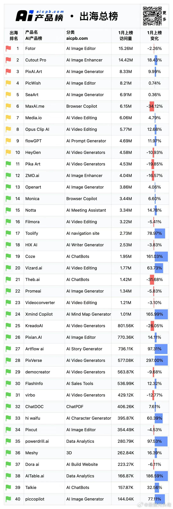

推荐一个网站网页[链接](https://www.joinprospect.com/?continueFlag=9ed4073da645ed76363a9dbef9444428)，这网站很有趣给市面上Top的startup们一个能翻几倍的rating。

比如里面OpenAI是2x（翻两倍），Character.ai是5x，SpaceX，Stripe，Discord，Anthropic和Anyscale等知名公司也是2x。

这个网站本质是用AI来搜寻独角兽工作机会的网站，大家可以上传自己的简历进去看看能不能匹配对应的工作机会。

甚至上面有Equity Calculator帮你计算你如果加入公司未来可能获得股权和投资回报比。

这里也不难看出GenAI泡沫太大，以至于知名的AI公司们都只有2x/3x。

分享/AI方面的🉑️按照下面这个榜找实习和全职工作
{: width="700" height="400" }

